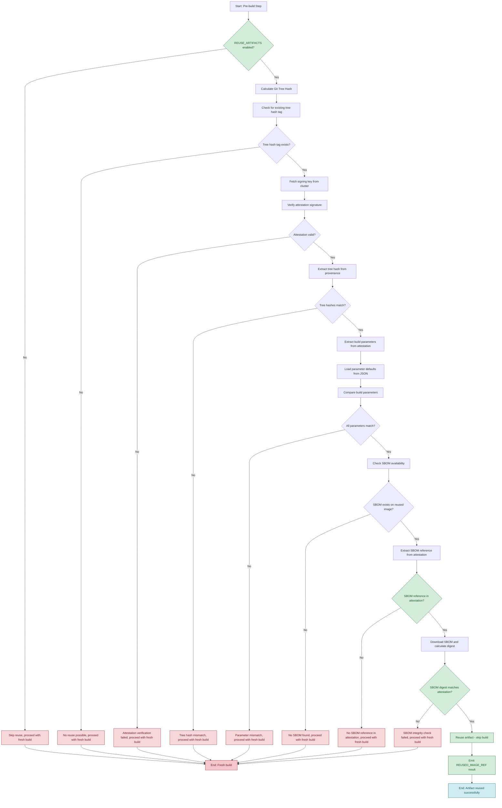

# Artifact Reuse Feature for Konflux CI/CD

## Overview

This document describes the implementation of an artifact reuse feature within the Konflux CI/CD system to avoid redundant builds, thereby saving time, workspace quota, and cloud costs. The feature allows reusing artifacts even if git commits differ, by hashing source content and prefetch cache.

### Purpose and Benefits

The primary purpose of this feature is to **eliminate redundant builds and network transfers** of large container images, which can be extremely expensive in terms of both time and money. Many of the artifacts produced by our build system are very large (> 50 GB), making network transfers prohibitively expensive and time-consuming.

**Key Benefits:**
- **Significant Time Savings**: Avoids redundant build times. (90%+ time savings for identical content). Merge pipeline builds complete in < 1m. User feedback has been that Konflux adds significant time to e2e build process. This is a first step to reduce e2e build times.
- **Preserve multi-arch builder capacity**: Frees build capacity on constrained architectures
- **Resource Efficiency**: Reduces compute and storage costs across the CI/CD pipeline
- **Network Bandwidth Conservation**: Prevents unnecessary downloads and uploads of large container images

The feature is specifically designed to **eliminate network transfer of artifacts when they are reused**, which is critical for large container images where transfer costs can exceed build costs.

## New Parameters

### Task Parameters Added

The following new parameters have been added to the `buildah` task to support artifact reuse functionality:

#### `EVENT_TYPE` (string, optional)
- **Purpose**: Identifies the pipeline event type for intelligent label handling
- **Values**: `"push"`, `"pull_request"`, or empty (not set)
- **Usage**: Determines whether to remove expiration labels when reusing artifacts
- **Default**: `""` (empty string)
- **Pipeline Integration**: Automatically set by Pipelines as Code, can be manually set for other environments

#### `REMOVE_EXPIRES_LABEL` (string, optional)
- **Purpose**: Controls whether to remove `quay.expires-after` labels from reused artifacts
- **Values**: `"true"`, `"false"`
- **Default**: `"false"`
- **Behavior**:
  - `"true"`: Always remove expiration labels (artifacts become permanent)
  - `"false"`: Only remove labels in push pipelines (default behavior)
- **Use Cases**: Manual override for non-Pipelines as Code environments

#### `REUSE_ARTIFACTS` (string, optional)
- **Purpose**: Enables or disables the artifact reuse feature
- **Values**: `"true"`, `"false"`
- **Default**: `"true"`
- **Usage**: Can be set to `"false"` to force fresh builds for testing or debugging

#### `REUSE_COMPARISON_EXCLUSIONS` (array, optional)
- **Purpose**: Specifies task parameters to exclude from build configuration comparison
- **Default**: `["IMAGE_EXPIRES_AFTER", "COMMIT_SHA"]`
- **Format**: YAML array of parameter names
- **Usage**: Allows fine-tuning of which parameters affect artifact reuse decisions

### Pipeline Parameters

#### `event_type` (Pipelines as Code)
- **Purpose**: Automatically set by Pipelines as Code to identify pipeline type
- **Values**: `"push"`, `"pull_request"`, or not set
- **Integration**: Automatically passed to the `EVENT_TYPE` task parameter
- **Behavior**:
  - `"push"`: Production builds, expiration labels removed
  - `"pull_request"`: Development builds, expiration labels preserved
  - Not set: Manual retriggers, expiration labels preserved

### Environment Variables Added

The following environment variables are automatically set in task steps:

#### `EVENT_TYPE`
- **Step**: `pre-build`, `push`
- **Source**: `$(params.EVENT_TYPE)`
- **Usage**: Available in scripts for pipeline type detection

#### `PLATFORM` (Remote Tasks Only)
- **Step**: `pre-build`, `push`
- **Source**: `$(params.PLATFORM)`
- **Usage**: Available in matrix builds for platform-specific tree hash tags
- **Note**: Only available in `buildah-remote` and `buildah-remote-oci-ta` tasks

### Results Added

#### `GIT_TREE_HASH` (string)
- **Purpose**: Contains the git tree hash of the source code
- **Emitted by**: `pre-build` step
- **Usage**: Used by downstream steps for tree hash tagging and verification
- **Format**: 40-character git tree hash (e.g., `2c737dd76a10f15174072f6d71aef82a7d11118d`)

#### `REUSED_IMAGE_REF` (string)
- **Purpose**: Contains the reference to the reused image with digest
- **Emitted by**: `pre-build` step (when reuse occurs)
- **Format**: `image@sha256:digest` (e.g., `quay.io/repo@sha256:abc123...`)
- **Usage**: Used by downstream steps to identify reused artifacts

#### `EVENT_TYPE` (string)
- **Purpose**: Echoes the EVENT_TYPE parameter for downstream tasks
- **Emitted by**: `pre-build` step
- **Usage**: Allows downstream tasks to access the event type information

## Key Technical Concepts

### Artifact Reuse
Core feature to avoid redundant builds by reusing existing container images when source content and build parameters match.

### Git Tree Hash
Used as a unique identifier for source content, allowing reuse even with different commit metadata. The tree hash represents the actual file content structure regardless of commit messages, timestamps, or other metadata.

### Build Configuration Fingerprint
A set of build parameters that must match for artifact reuse. The system compares all **task parameters** (not pipeline parameters) except those explicitly excluded via the `REUSE_COMPARISON_EXCLUSIONS` parameter to ensure identical build configurations. **Parameter defaults are automatically extracted from the task definition and used for accurate comparison when parameters are not explicitly provided.**

### Expiration Label Control
The `REMOVE_EXPIRES_LABEL` parameter controls whether expiration labels are removed when reusing artifacts:
- **Default behavior**: Only removes labels in push pipelines (when `event_type = "push"`)
- **Manual override**: Set to `"true"` to always remove labels regardless of pipeline type
- **Preserve labels**: Set to `"false"` to never remove labels (useful for non-Pipelines as Code environments)

### Multi-Architecture Support
The `PLATFORM` parameter enables architecture-specific tree hash tags for multi-architecture builds:
- **Purpose**: Prevents race conditions when multiple architectures claim the same tree hash tag
- **Format**: `tree-<hash>-<platform>` (e.g., `tree-abc123-linux-amd64`, `tree-abc123-linux-arm64`)
- **Usage**: Automatically included in tree hash tags when `PLATFORM` parameter is provided
- **Matrix Detection**: Indicates when the task is running in a Tekton matrix context
- **Platform Sanitization**: Platform strings are sanitized to create valid Docker tag names (e.g., `linux/amd64` → `linux-amd64`)

### Cosign
Used for handling image attestations (signing, verifying, attaching SBOMs, downloading attestations).

### oci-config-mod
A custom Go tool for modifying OCI image labels and creating tags directly via the registry API without pulling image blobs. Used for efficient label removal and updates during artifact reuse, as well as creating multiple tags in a single operation. Available at [https://github.com/brianwcook/oci-config-mod](https://github.com/brianwcook/oci-config-mod).


## Implementation Details

Equivalent results should be emitted for every and every task in the pipeline.
The prevents downstream tasks from breaking when artifacts are resued.

### oci-config-mod Integration

The system uses the `oci-config-mod` tool for efficient OCI image label manipulation and tag creation during artifact reuse. This tool operates directly on the registry API without downloading image blobs, making it significantly more efficient than traditional approaches.

#### oci-config-mod Command Structure

The tool supports a unified command for both label modifications and tag creation:

```bash
oci-config-mod modify-labels <source-image> \
  --remove <label-to-remove> \
  --update <label_key=value> \
  --tag <new-tag1> \
  --tag <new-tag2> \
  --tag <new-tag3> \
  --tag <new-tag4>
```

#### Key Features

- **Label Removal**: Removes specific OCI labels (e.g., `quay.expires-after`)
- **Label Updates**: Updates existing labels (e.g., `vcs-ref` to current commit)
- **Multi-Tag Creation**: Creates multiple tags in a single operation
- **Digest-Based References**: Supports both tag and digest-based image references
- **Registry API Direct**: Operates directly on registry API without blob downloads
- **Authentication**: Uses standard Docker authentication mechanisms

#### Usage in Artifact Reuse

During artifact reuse, `oci-config-mod` is used to:

1. **Remove Expiration Labels**: When reusing PR artifacts in push pipelines
2. **Update Commit References**: Update `vcs-ref` label to current commit SHA
3. **Create All Tags**: Create TaskRun, Git revision, and tree hash tags in one operation
4. **Platform-Specific Tagging**: Creates platform-specific tree hash tags for matrix builds

#### Platform-Specific Tag Creation

The `oci-config-mod` command automatically handles platform-specific tree hash tags:

```bash
# Add tree hash tag if available
if [ -n "$TREE_HASH" ]; then
  # Use platform-specific tree hash tag if PLATFORM is available
  if [ -n "${PLATFORM:-}" ]; then
    # Sanitize platform string for use in Docker tags
    SANITIZED_PLATFORM="${PLATFORM//[^a-zA-Z0-9_.-]/-}"
    LABEL_MOD_CMD="$LABEL_MOD_CMD --tag tree-$TREE_HASH-$SANITIZED_PLATFORM"
  else
    LABEL_MOD_CMD="$LABEL_MOD_CMD --tag tree-$TREE_HASH"
  fi
fi
```

This ensures that both fresh builds and reused artifacts create consistent platform-specific tags.

#### Authentication Handling

The tool uses standard Docker authentication:
- Reads authentication from `/tmp/auth/config.json` (copied from `AUTHFILE`)
- Falls back to default Docker authentication locations
- Supports both push and pull authentication for registry operations

#### Error Handling

The system includes comprehensive error handling for `oci-config-mod` operations:
- **Authentication Failures**: Logs detailed authentication debugging
- **Transport Errors**: Handles image reference parsing issues
- **Manifest Errors**: Handles digest/tag reference mismatches
- **Fallback Mechanisms**: Falls back to fresh build on critical failures

### Tree Hash Calculation and Result Emission

The system calculates the git tree hash once in the build step and emits it as a Tekton result:

```bash
# Calculate tree hash from git commit
if [ -n "$COMMIT_SHA" ]; then
  TREE_HASH=$(git -C "$(workspaces.source.path)/source" show -s --format="%T" "$COMMIT_SHA")
  echo "Tree hash for commit $COMMIT_SHA: $TREE_HASH"
  # Emit the tree hash result
  echo -n "$TREE_HASH" | tee $(results.GIT_TREE_HASH.path)
else
  echo "No COMMIT_SHA provided, skipping artifact reuse"
  TREE_HASH=""
  # Emit empty tree hash result
  echo -n "" | tee $(results.GIT_TREE_HASH.path)
fi
```

**Result**: `GIT_TREE_HASH` - Git tree hash of the source code

### Dynamic Parameter Comparison

The artifact reuse feature uses an exclusion-based approach for parameter comparison. All **task parameters** (not pipeline parameters) are automatically included in the build configuration fingerprint unless explicitly excluded via the `REUSE_COMPARISON_EXCLUSIONS` parameter.

#### Parameter Discovery and Comparison

The system dynamically discovers all available **task parameters** from environment variables and filters out excluded ones:

```bash
# Get all available task parameters dynamically from environment variables
# This will automatically include any new task parameters that are added to the task
ALL_PARAMS=()
for env_var in $(env | grep -E '^[A-Z_]+=' | cut -d'=' -f1 | sort); do
  # Only include parameters that are likely to be task parameters
  # (exclude system environment variables and internal variables)
  if [[ "$env_var" =~ ^[A-Z_]+$ ]] && [[ ! "$env_var" =~ ^(PATH|HOME|USER|SHELL|PWD|HOSTNAME|TERM|LANG|LC_|SHLVL|LOGNAME|OLDPWD|_) ]]; then
    ALL_PARAMS+=("$env_var")
  fi
done

# Filter out excluded task parameters
COMPARISON_PARAMS=()
for param in "${ALL_PARAMS[@]}"; do
  # Check if this task parameter is in the exclusion list
  excluded=false
  for excluded_param in "${EXCLUSION_PARAMS[@]}"; do
    if [ "$param" = "$excluded_param" ]; then
      excluded=true
      break
    fi
  done

  if [ "$excluded" = "false" ]; then
    COMPARISON_PARAMS+=("$param")
  fi
done
```

#### Default Exclusion List

The following **task parameters** are excluded by default from the build configuration fingerprint:

```yaml
REUSE_COMPARISON_EXCLUSIONS:
  - IMAGE_EXPIRES_AFTER
  - COMMIT_SHA

```

#### Parameter Mapping for Attestation Comparison

The system dynamically maps **task parameters** to attestation fields using kebab-case conversion:

```bash
# Convert UPPER_SNAKE_CASE to kebab-case for attestation lookup
param_kebab=$(echo "$param" | tr '[:upper:]' '[:lower:]' | sed 's/_/-/g')

# Special handling for CONTEXT parameter mapping
if [ "$param" = "CONTEXT" ]; then
  param_kebab="path-context"
fi
```

**Parameters Excluded from Build Configuration Fingerprint:**
The following **task parameters** are **intentionally excluded** from the comparison:
- `IMAGE_EXPIRES_AFTER` (varies between PR and push builds)
- `COMMIT_SHA` (metadata, not build configuration)


#### Dynamic Parameter Value Retrieval

The system uses indirect parameter expansion to dynamically retrieve **task parameter** values:

```bash
# Use indirect parameter expansion to get the value dynamically
# This will work for any parameter name without needing to update the case statement
param_value="${!param:-}"
if [ -n "$param_value" ]; then
  current_value="$param_value"
else
  echo "Warning: Parameter $param not found in environment, treating as empty"
  current_value=""
fi
```

#### Array Parameter Handling

Special handling is provided for array **task parameters** to compare empty strings with empty arrays:

```bash
# Define array parameters that need special handling
# This list can be easily updated when new array parameters are added
ARRAY_PARAMS=("BUILD_ARGS" "LABELS" "ANNOTATIONS" "ADDITIONAL_BASE_IMAGES")

# Check if current parameter is an array parameter
is_array_param=false
for array_param in "${ARRAY_PARAMS[@]}"; do
  if [ "$param" = "$array_param" ]; then
    is_array_param=true
    break
  fi
done

if [ "$is_array_param" = "true" ]; then
  # Special handling for array parameters - compare empty string with empty array
  if [ "$current_value" = "" ] && [ "$existing_value" = "[]" ]; then
    echo "Parameter $param matches: '$current_value' (empty) vs '$existing_value' (empty array)"
  elif [ "$current_value" = "$existing_value" ]; then
    echo "Parameter $param matches: '$current_value'"
  else
    echo "Parameter mismatch for $param: current='$current_value' vs existing='$existing_value'"
    CONFIG_MATCHES=false
    break
  fi
else
  # Regular comparison for other parameters
  if [ "$current_value" != "$existing_value" ]; then
    echo "Parameter mismatch for $param: current='$current_value' vs existing='$existing_value'"
    CONFIG_MATCHES=false
    break
  else
    echo "Parameter $param matches: '$current_value'"
  fi
fi
```

### Parameter Defaults Handling

The artifact reuse feature now includes intelligent handling of task parameter defaults to ensure accurate build configuration comparison.

#### Problem Solved

Previously, the system would skip parameters that weren't explicitly provided to the pipeline with a message like "Parameter ACTIVATION_KEY not in attestation (likely has default value), skipping comparison". This was problematic because:

1. **Inaccurate Comparison**: The system didn't know what the actual default values were
2. **Missed Reuse Opportunities**: Parameters with defaults were being ignored in comparison
3. **Inconsistent Behavior**: The same build configuration could be treated differently depending on whether defaults were explicitly provided

#### Solution: Automated Default Value Extraction

The system now automatically extracts parameter defaults from the task definition and uses them for accurate comparison:

##### Makefile Integration

The `make taskyaml` command now includes an `extract-param-defaults` step that:

1. **Extracts Defaults**: Parses `buildah.template.yaml` to find all parameters with default values
2. **Generates JSON**: Creates a JSON file with parameter names and their default values
3. **Distributes**: Copies the JSON file to the `steps/` directory for use during task execution

```bash
# Extract parameter defaults as JSON
extract-param-defaults:
	@echo "Extracting parameter defaults from task template..."
	@yq eval -o=json '.spec.params[] | select(has("default")) | {"name": .name, "default": .default}' $(YAML_TEMPLATE) | \
	jq -s 'reduce .[] as $$item ({}; . + {($$item.name): $$item.default})' > param-defaults.json
	@cp param-defaults.json $(SCRIPTS_DIR)/param-defaults.json
```

##### Generated Parameter Defaults

The system generates a JSON file containing all parameters with default values:

```json
{
  "ACTIVATION_KEY": "activation-key",
  "ADDITIONAL_SECRET": "does-not-exist",
  "ADD_CAPABILITIES": "",
  "ANNOTATIONS_FILE": "",
  "BUILD_ARGS_FILE": "",
  "COMMIT_SHA": "",
  "CONTEXT": ".",
  "DOCKERFILE": "./Dockerfile",
  "ENTITLEMENT_SECRET": "etc-pki-entitlement",
  "EVENT_TYPE": "",
  "HERMETIC": "false",
  "IMAGE_EXPIRES_AFTER": "",
  "INHERIT_BASE_IMAGE_LABELS": "true",
  "PREFETCH_INPUT": "",
  "PRIVILEGED_NESTED": "false",
  "REMOVE_EXPIRES_LABEL": "false",
  "REUSE_ARTIFACTS": "true",
  "SBOM_TYPE": "spdx",
  "SKIP_SBOM_GENERATION": "false",
  "SKIP_UNUSED_STAGES": "true",
  "SQUASH": "false",
  "STORAGE_DRIVER": "overlay",
  "TARGET_STAGE": "",
  "TLSVERIFY": "true",
  "WORKINGDIR_MOUNT": "",
  "YUM_REPOS_D_FETCHED": "fetched.repos.d",
  "YUM_REPOS_D_SRC": "repos.d",
  "YUM_REPOS_D_TARGET": "/etc/yum.repos.d"
}
```

##### Runtime Default Value Usage

During task execution, the pre-build script loads these defaults and uses them when parameters are not explicitly provided:

```bash
# Load parameter defaults from JSON file (generated by Makefile)
PARAM_DEFAULTS="{}"
SCRIPT_DIR="$(cd "$(dirname "${BASH_SOURCE[0]}")" && pwd)"
if [ -f "$SCRIPT_DIR/param-defaults.json" ]; then
  PARAM_DEFAULTS=$(cat "$SCRIPT_DIR/param-defaults.json")
  echo "Loaded parameter defaults from $SCRIPT_DIR/param-defaults.json"
else
  echo "Warning: param-defaults.json not found in $SCRIPT_DIR, using empty defaults"
fi

# When comparing parameters:
param_value="${!param:-}"
if [ -n "$param_value" ]; then
  current_value="$param_value"
else
  # Try to get default value from JSON
  current_value=$(echo "$PARAM_DEFAULTS" | jq -r --arg param "$param" '.[$param] // empty')
  if [ -n "$current_value" ]; then
    echo "Parameter $param not in environment, using default value: '$current_value'"
  else
    echo "Warning: Parameter $param not found in environment and no default available, treating as empty"
    current_value=""
  fi
fi
```

##### Benefits

1. **Accurate Comparison**: Parameters with defaults are now properly compared using their actual default values
2. **Consistent Behavior**: The same build configuration will always be treated the same way, regardless of whether defaults are explicitly provided
3. **Maintainable**: Single source of truth (the task template) - no manual maintenance required
4. **Automated**: Defaults are automatically extracted and updated when the task template changes

##### Example: ACTIVATION_KEY Parameter

Before this improvement:
- `ACTIVATION_KEY` has default value `"activation-key"` in task definition
- When pipeline doesn't provide it, Tekton applies the default
- System would skip comparison with "likely has default value"
- Could miss reuse opportunities due to incomplete comparison

After this improvement:
- System loads default value `"activation-key"` from JSON
- Uses this value for comparison when parameter not explicitly provided
- Provides accurate comparison and better reuse opportunities

### Artifact Reuse Decision Flow

The following flowchart illustrates the complete decision process for artifact reuse:



**Decision Points Explained:**

1. **REUSE_ARTIFACTS Check**: Feature can be disabled for testing/debugging
2. **Tree Hash Calculation**: Based on actual source content, not commit metadata
3. **Tree Hash Tag Existence**: Checks if a previous build with same content exists
4. **Attestation Verification**: Ensures the existing artifact is authentic and signed
5. **Tree Hash Consistency**: Verifies the attestation contains the expected tree hash
6. **Parameter Comparison**: Compares all build parameters (using defaults when needed)
7. **SBOM Availability**: Ensures security compliance by requiring SBOM on reused artifacts
8. **SBOM Integrity Verification**: Verifies the attached SBOM matches the one recorded in provenance

**Key Features:**
- **Security**: Attestation verification prevents reuse of malicious artifacts
- **Accuracy**: Parameter defaults ensure consistent comparison
- **Compliance**: SBOM requirement ensures security standards are met
- **Integrity**: SBOM digest verification prevents tampering
- **Flexibility**: Can be disabled for debugging or testing scenarios

### Security and Verification Benefits

The artifact reuse feature provides significant security and verification capabilities through the preservation of original image references with digests.

#### Original Image Reference Preservation

When an artifact is reused, the system preserves the **original image reference with digest** in the `REUSED_IMAGE_REF` result:

```bash
# Example: Original image reference preserved
REUSED_IMAGE_REF="quay.io/repo/image@sha256:abc123def456..."
```

This original reference enables several critical security and verification capabilities:

#### 1. **Blob Integrity Verification**

Policy engines or security tools can verify that only the **config object** was modified, not the image blobs:

```bash
# Extract original image digest
ORIGINAL_DIGEST=$(echo "$REUSED_IMAGE_REF" | sed 's/.*@sha256://')

# Compare layer digests between original and modified image
# Only the config layer should differ, all blob layers should be identical
skopeo inspect "docker://$REUSED_IMAGE_REF" | jq '.Layers'
skopeo inspect "docker://$NEW_IMAGE_REF" | jq '.Layers'
```

#### 2. **Policy Engine Integration**

Security policy engines can use the original reference to:

- **Verify Layer Integrity**: Ensure no blob layers were modified
- **Audit Changes**: Log exactly what changed (config only vs blob changes)
- **Compliance Checking**: Validate that only approved modifications occurred
- **Chain of Custody**: Track the complete modification history

#### 3. **Forensic Analysis**

In case of security incidents, investigators can:

- **Compare Images**: Use the original digest to verify what was actually modified
- **Verify Authenticity**: Confirm the original image was legitimate before modification
- **Audit Trail**: Track the complete modification chain from original to final image

#### 4. **Regulatory Compliance**

For regulated environments, this capability enables:

- **Change Verification**: Prove that only approved modifications occurred
- **Audit Logging**: Maintain complete records of image modifications
- **Policy Enforcement**: Ensure modifications comply with security policies

#### Example Verification Process

```bash
# 1. Get the original image reference (preserved during reuse)
ORIGINAL_REF="quay.io/repo/image@sha256:abc123def456..."

# 2. Get the modified image reference (created by oci-config-mod)
MODIFIED_REF="quay.io/repo/image:new-tag@sha256:def789ghi012..."

# 3. Extract layer information
ORIGINAL_LAYERS=$(skopeo inspect "docker://$ORIGINAL_REF" | jq -r '.Layers[]')
MODIFIED_LAYERS=$(skopeo inspect "docker://$MODIFIED_REF" | jq -r '.Layers[]')

# 4. Verify only config layer differs (first layer)
ORIGINAL_CONFIG=$(echo "$ORIGINAL_LAYERS" | head -1)
MODIFIED_CONFIG=$(echo "$MODIFIED_LAYERS" | head -1)

# 5. Verify all blob layers are identical
ORIGINAL_BLOBS=$(echo "$ORIGINAL_LAYERS" | tail -n +2)
MODIFIED_BLOBS=$(echo "$MODIFIED_LAYERS" | tail -n +2)

if [ "$ORIGINAL_BLOBS" = "$MODIFIED_BLOBS" ]; then
    echo "✅ VERIFIED: Only config layer modified, all blob layers preserved"
else
    echo "❌ WARNING: Blob layers were modified - potential security issue"
fi
```

This verification capability is **critical for security compliance** and ensures that artifact reuse maintains the integrity of the original image while only modifying the necessary configuration elements (labels, tags).

### SBOM Integrity Verification for Policy Engines

The artifact reuse feature provides comprehensive SBOM integrity verification that enables policy engines and security tools to verify that the SBOM attached to reused artifacts is authentic and unchanged.

#### SBOM Reference in Attestation

When an SBOM is attached to an image, its OCI reference is recorded in the attestation:

```json
{
  "predicate": {
    "buildConfig": {
      "tasks": [
        {
          "results": [
            {
              "name": "SBOM_BLOB_URL",
              "value": "quay.io/repo/image@sha256:abc123def456..."
            }
          ]
        }
      ]
    }
  }
}
```

This reference contains the exact digest of the SBOM blob, enabling cryptographic verification.

#### Policy Engine Verification Process

Policy engines can independently verify SBOM integrity using the preserved attestation:

```bash
# 1. Get the reused image reference (preserved during reuse)
REUSED_IMAGE_REF="quay.io/repo/image@sha256:abc123def456..."

# 2. Download the attestation from the reused image
ATTESTATION_JSON=$(cosign download attestation "$REUSED_IMAGE_REF" | jq -r '.payload | @base64d | fromjson')

# 3. Extract the expected SBOM reference from attestation
EXPECTED_SBOM_REF=$(echo "$ATTESTATION_JSON" | jq -r '.predicate.buildConfig.tasks[] | select(.results[]?.name == "SBOM_BLOB_URL") | .results[] | select(.name == "SBOM_BLOB_URL") | .value')

# 4. Download the actual SBOM from the image
cosign download sbom "$REUSED_IMAGE_REF" > actual-sbom.json

# 5. Calculate the actual SBOM digest
ACTUAL_SBOM_DIGEST=$(sha256sum actual-sbom.json | cut -d' ' -f1)

# 6. Extract expected digest from attestation reference
EXPECTED_SBOM_DIGEST=$(echo "$EXPECTED_SBOM_REF" | sed 's/.*@sha256://')

# 7. Verify integrity
if [ "$EXPECTED_SBOM_DIGEST" = "$ACTUAL_SBOM_DIGEST" ]; then
    echo "✅ SBOM integrity verified: digest matches attestation"
    echo "Policy: ALLOW - SBOM is authentic and unchanged"
else
    echo "❌ SBOM integrity check failed: digest mismatch"
    echo "Policy: DENY - SBOM may have been tampered with"
fi
```

#### Verification Benefits for Policy Engines

This capability enables policy engines to:

1. **Cryptographic Verification**: Prove that the SBOM hasn't been modified since the original build
2. **Tamper Detection**: Identify if the SBOM content has been altered
3. **Compliance Assurance**: Ensure regulatory requirements for SBOM integrity are met
4. **Audit Trail**: Maintain complete records of SBOM verification results
5. **Automated Enforcement**: Automatically allow/deny based on SBOM integrity

#### Integration with Existing Security Controls

The SBOM integrity verification complements existing security measures:

- **Attestation Verification**: Ensures the build was legitimate
- **Tree Hash Verification**: Ensures source content is identical
- **Parameter Verification**: Ensures build configuration is identical
- **SBOM Integrity Verification**: Ensures SBOM content is identical

#### Example Policy Engine Integration

```yaml
# Example policy rule for SBOM integrity
apiVersion: policy.example.com/v1
kind: ImagePolicy
metadata:
  name: sbom-integrity-policy
spec:
  rules:
  - name: verify-sbom-integrity
    match:
      resources:
        kinds: ["Image"]
    validate:
      message: "SBOM integrity verification failed"
      pattern: |
        # Verify SBOM digest matches attestation
        # This ensures the SBOM hasn't been tampered with
        # since the original build
```

This verification capability ensures that policy engines can independently verify that the SBOM attached to reused artifacts is the exact same SBOM that was originally generated, providing cryptographic proof of SBOM integrity and preventing tampering.

### Attestation Verification

The system uses `cosign verify-attestation` with dynamically fetched keys:
- **Dynamic key fetching**: Retrieves the public key from the cluster using `kubectl -n openshift-pipelines get secret public-key`
- `--insecure-ignore-tlog` - Skip transparency log verification
- `--type https://slsa.dev/provenance/v0.2` - Specify SLSA provenance attestation type

**Benefits of dynamic key fetching**:
- **Security**: No static keys in container images
- **Flexibility**: Keys can be updated without rebuilding containers
- **Cluster-specific**: Each cluster can have its own signing keys
- **Audit trail**: Key changes are tracked in the cluster's secret management
- **Security**: Falls back to new build if attestation verification fails

**Failure Scenarios**:
- **Key Mismatch**: Image was signed with a different key than the one in the cluster
- **Key Rotation**: Cluster's signing key has been rotated since the image was built
- **Environment Mismatch**: Image was built in a different environment/cluster

**Behavior on Verification Failure**:
- Logs a detailed warning with possible causes
- Falls back to new build (attestation verification is a critical security check)
- Provides clear diagnostics for troubleshooting
- Ensures security by not reusing unverified artifacts

### Tree Hash Verification in Provenance

After downloading the attestation, the system verifies that the tree hash in the signed provenance matches the calculated tree hash. In multi-architecture builds, multiple tasks may emit the same `GIT_TREE_HASH` result, requiring special handling to ensure consistency.

#### Multiple Hash Handling

The system extracts all tree hashes from the provenance and verifies they are all identical before proceeding with artifact reuse:

```bash
# Extract all tree hashes from provenance and verify they're all the same
PROVENANCE_TREE_HASHES=$(echo "$ATTESTATION_JSON" | jq -r '.predicate.buildConfig.tasks[] | select(.results[]?.name == "GIT_TREE_HASH") | .results[] | select(.name == "GIT_TREE_HASH") | .value // empty')

if [ -z "$PROVENANCE_TREE_HASHES" ]; then
  echo "Failed to extract tree hash from provenance"
  echo "false" > "$(workspaces.source.path)/artifact-reused"
  echo "Proceeding with build due to provenance tree hash extraction failure"
  exit 0
fi

# Check if all tree hashes are the same
UNIQUE_HASHES=$(echo "$PROVENANCE_TREE_HASHES" | sort | uniq)
HASH_COUNT=$(echo "$UNIQUE_HASHES" | wc -l)

if [ "$HASH_COUNT" -gt 1 ]; then
  echo "ERROR: Inconsistent tree hashes found in provenance:"
  echo "$PROVENANCE_TREE_HASHES"
  echo "Unique hashes: $UNIQUE_HASHES"
  echo "false" > "$(workspaces.source.path)/artifact-reused"
  echo "Proceeding with build due to inconsistent tree hashes in provenance"
  exit 0
fi

# Use the single unique tree hash
PROVENANCE_TREE_HASH=$(echo "$UNIQUE_HASHES" | head -n1)
echo "Verified all tree hashes in provenance are consistent: $PROVENANCE_TREE_HASH"

if [ "$PROVENANCE_TREE_HASH" != "$TREE_HASH" ]; then
  echo "Tree hash mismatch: provenance has $PROVENANCE_TREE_HASH, calculated $TREE_HASH"
  echo "false" > "$(workspaces.source.path)/artifact-reused"
  echo "Proceeding with build due to tree hash mismatch"
  exit 0
fi

echo "Tree hash verification successful: $TREE_HASH"
```

#### Consistency Validation

This approach ensures:
- **Multiple hash detection**: Identifies when different tasks have different tree hashes
- **Consistency enforcement**: Only proceeds with reuse when all hashes are identical
- **Security improvement**: Forces rebuilds when provenance is inconsistent rather than making arbitrary choices
- **Better error reporting**: Shows all hashes found when inconsistencies are detected

### Tree Hash Tagging

Images are tagged with tree hash tags in Quay.io for efficient artifact discovery. The format varies based on whether the build is part of a multi-architecture matrix:

#### Standard Tree Hash Tags
- **Format**: `tree-<git-tree-hash>`
- **Example**: `tree-2c737dd76a10f15174072f6d71aef82a7d11118d`
- **Usage**: Single-architecture builds or non-matrix builds

#### Platform-Specific Tree Hash Tags
- **Format**: `tree-<git-tree-hash>-<sanitized-platform>`
- **Example**: `tree-2c737dd76a10f15174072f6d71aef82a7d11118d-linux-amd64`
- **Usage**: Multi-architecture matrix builds
- **Platform Sanitization**: Platform strings are sanitized to create valid Docker tag names
  - `linux/amd64` → `linux-amd64`
  - `linux/arm64` → `linux-arm64`
  - `linux/s390x` → `linux-s390x`

#### Tag Creation Logic

The system automatically determines the appropriate tag format:

```bash
# Include platform in tree tag if PLATFORM parameter is provided
if [ -n "${PLATFORM:-}" ]; then
  # Sanitize platform string for use in Docker tags
  SANITIZED_PLATFORM="${PLATFORM//[^a-zA-Z0-9_.-]/-}"
  TREE_TAG="tree-${TREE_HASH}-${SANITIZED_PLATFORM}"
else
  TREE_TAG="tree-${TREE_HASH}"
fi
```

**Important Security Note**: The tree hash tag is only used as a **candidate identifier** for potential artifact reuse. The system does **not** blindly trust this tag. Instead, it performs comprehensive security verification by:

1. **Downloading and verifying attestations** from the candidate image
2. **Validating cryptographic signatures** using trusted public keys
3. **Extracting and comparing tree hashes** from the signed provenance
4. **Verifying parameter consistency** between current and attested builds

This multi-layered verification prevents potential attack vectors where malicious actors could create fake tree hash tags.

### Tag Consistency Between Fresh and Reused Builds

Both fresh builds and reused builds create the same three tags:

1. **TaskRun Name Tag**: `registry/repo:${TASKRUN_NAME}` (unique/race condition prevention)
2. **Git Revision Tag**: `$(params.IMAGE)` (primary/user-specified)
3. **Tree Hash Tag**: `registry/repo:tree-${TREE_HASH}` (artifact reuse)

This ensures consistent tag structure regardless of whether artifacts are reused or built fresh.

### Digest Resolution

The system resolves tree hash tags to image digests for cosign operations:
```bash
TREE_TAG_DIGEST=$(skopeo inspect "docker://$IMAGE_REPO:$TREE_TAG" | jq -r '.Digest')
```

### Security Verification Process

After discovering a candidate artifact via tree hash tag, the system performs the following security verification steps:

#### 1. Tree Hash Tag Discovery
```bash
# Check if the tree hash tag exists using skopeo inspect (more efficient than list-tags)
if skopeo inspect "docker://${IMAGE%:*}:${TREE_TAG}" >/dev/null 2>&1; then
  echo "Found tree hash tag: ${TREE_TAG}"
else
  echo "No existing tree hash tag found: ${TREE_TAG}"
  echo "false" > "$(workspaces.source.path)/artifact-reused"
  echo "Proceeding with build due to no existing tree hash tag"
  exit 1
fi
```

#### 2. Dynamic Key Fetching and Attestation Verification
```bash
# Get the digest for the tree hash tag
TREE_TAG_DIGEST=$(skopeo inspect "docker://${IMAGE%:*}:${SELECTED_CANDIDATE}" | jq -r '.Digest')
echo "Tree hash tag digest: $TREE_TAG_DIGEST"

# Dynamically fetch the signing key from the cluster
echo "Fetching signing key from cluster..."
SIGNING_KEY=$(kubectl -n openshift-pipelines get secret public-key -o json | jq '.data["cosign.pub"] | @base64d' -r 2>/dev/null || echo "")


if [ -z "$SIGNING_KEY" ]; then
  echo "Failed to fetch signing key from cluster"
  echo "false" > "$(workspaces.source.path)/artifact-reused"
  echo "Proceeding with build due to signing key fetch failure"
  exit 1
fi

# Verify attestation signature using the dynamically fetched key
echo "Verifying attestation signature..."
if ! cosign verify-attestation --key <(echo "$SIGNING_KEY") --insecure-ignore-tlog --type https://slsa.dev/provenance/v0.2 "${IMAGE%:*}:${SELECTED_CANDIDATE}" >/dev/null 2>&1; then
  echo "Failed to verify attestation signature"
  echo "false" > "$(workspaces.source.path)/artifact-reused"
  echo "Proceeding with build due to attestation verification failure"
  exit 1
fi

echo "Attestation signature verification successful"
```

#### 3. Provenance Extraction and Tree Hash Verification
```bash
# Use the digest for attestation download
ATTESTATION_JSON=$(cosign download attestation "$IMAGE_REPO@$TREE_TAG_DIGEST" 2>/dev/null | jq -r '.payload | @base64d | fromjson')
if [ -z "$ATTESTATION_JSON" ]; then
  echo "Failed to download attestation for $IMAGE_REPO@$TREE_TAG"
  echo "false" > "$(workspaces.source.path)/artifact-reused"
  echo "Proceeding with build due to attestation download failure"
  exit 1
fi

# Verify tree hash in provenance matches our calculated tree hash
echo "Verifying tree hash in provenance..."
PROVENANCE_TREE_HASH=$(echo "$ATTESTATION_JSON" | jq -r '.predicate.buildConfig.tasks[] | select(.results[]?.name == "GIT_TREE_HASH") | .results[] | select(.name == "GIT_TREE_HASH") | .value // empty')
if [ -z "$PROVENANCE_TREE_HASH" ]; then
  echo "Failed to extract tree hash from provenance"
  echo "false" > "$(workspaces.source.path)/artifact-reused"
  echo "Proceeding with build due to provenance tree hash extraction failure"
  exit 1
fi

if [ "$PROVENANCE_TREE_HASH" != "$TREE_HASH" ]; then
  echo "Tree hash mismatch: provenance has $PROVENANCE_TREE_HASH, calculated $TREE_HASH"
  echo "false" > "$(workspaces.source.path)/artifact-reused"
  echo "Proceeding with build due to tree hash mismatch"
  exit 1
fi

echo "Tree hash verification successful: $TREE_HASH"
```

#### 4. Build Parameter Verification
After tree hash verification, the system extracts and compares build parameters from the signed attestation to ensure identical build configurations.

This multi-step verification process ensures that:
- **Cryptographic signatures** validate the authenticity of the attestation
- **Tree hash consistency** confirms the source content matches
- **Parameter comparison** ensures build configurations are identical
- **Graceful degradation** falls back to fresh builds if any verification step fails

## Security Considerations

### Security Design Philosophy

The artifact reuse feature is designed with a **defense-in-depth** approach that does not trust any single identifier or tag. Instead, it implements a multi-layered verification process that validates:

1. **Cryptographic signatures** on attestations
2. **Tree hash consistency** between calculated and attested values
3. **Build parameter matching** from signed provenance
4. **Graceful degradation** when verification fails

This approach prevents various attack vectors while maintaining the efficiency benefits of artifact reuse.

### Potential Security Problems

1. **Attestation Verification Bypass**: The use of `--insecure-ignore-tlog` skips transparency log verification, which could allow replay attacks if attestations are not properly signed.

2. **Parameter Mapping Vulnerabilities**: Incorrect parameter mapping between task parameters and attestation fields could lead to false positive reuse matches.

3. **Tree Hash Collisions**: While extremely unlikely, git tree hash collisions could theoretically cause incorrect artifact reuse.

4. **Attestation Tampering**: If the Chains private key is compromised or incorrectly distributed, malicious attestations could be accepted.

5. **Digest Resolution Attacks**: The `skopeo inspect` command could be vulnerable to man-in-the-middle attacks if not properly authenticated.

6. **Workspace Data Exposure**: Reuse flags and intermediate data stored in the workspace could be exposed to subsequent pipeline steps.

7. **Fake Tree Hash Tags**: Malicious actors could potentially create fake tree hash tags to trigger reuse attempts.

8. **Compromised Buildah Task**: An artifact produced by a compromised buildah task could be reused, potentially spreading malicious code or vulnerabilities.

### Mitigation Strategies

1. **Multi-Layered Verification**: The system does not trust tree hash tags alone but performs comprehensive verification including attestation signatures, tree hash consistency, and parameter matching.

2. **Attestation Verification**: Implement proper attestation signature verification using trusted public keys.

3. **Parameter Validation**: Validate relevant build parameters are identical

4. **Audit Trail**: The reused artifacts provenance includes an immutable reference to the reused artifact.

5. **Fallback Mechanisms**: Implement proper fallback to fresh builds when verification fails.

6. **Tree Hash Verification**: Verify that the tree hash in the signed provenance matches the calculated tree hash to ensure provenance integrity.

7. **Exclusion List Management**: Maintain a comprehensive exclusion list to prevent sensitive parameters from being compared.

8. **Graceful Degradation**: Any verification failure results in a fresh build rather than potentially insecure reuse.

9. **Tree Hash Mismatch Protection**: If the tree hash in the signed provenance doesn't match the calculated tree hash, the system will fail to reuse the artifact, preventing potential security issues.

10. **Provenance Chain Verification**: Policy engines can inspect both the original build provenance and the reuse pipeline provenance, since the immutable reference to the original artifact is emitted as a result when an artifact is reused, enabling end-to-end security verification.

### Security Verification Flow

The system implements the following security verification flow:

```
Tree Hash Tag Discovery
         ↓
   Digest Resolution
         ↓
Attestation Download
         ↓
Signature Verification ← FAIL → Fresh Build
         ↓
Tree Hash Extraction
         ↓
Tree Hash Comparison ← FAIL → Fresh Build
         ↓
Parameter Extraction
         ↓
Parameter Comparison ← FAIL → Fresh Build
         ↓
    Artifact Reuse
```

This flow ensures that **every step** must succeed for artifact reuse to occur, providing multiple layers of security validation.

## Use Cases

### Re-running Failed Pipelines
When a pipeline fails due to infrastructure issues, the same source content can be rebuilt without redundant computation.

### Reusing PR Artifacts in Push Pipelines
Artifacts built for pull requests can be reused when the same changes are pushed to the main branch. The system automatically removes expiration labels during this process, converting temporary PR artifacts into permanent production artifacts.

### Cross-Environment Reuse
Artifacts built in one environment can potentially be reused in another environment with identical build configurations.

### Manual Expiration Label Control
For environments not using Pipelines as Code, the `REMOVE_EXPIRES_LABEL` parameter provides manual control over expiration label removal:
- Set to `"true"` for environments where all reused artifacts should become permanent
- Set to `"false"` for environments where temporary artifacts should remain temporary

### Future-Proof Parameter Handling
New **task parameters** added to the task are automatically included in comparison unless explicitly excluded, making the system more robust and maintainable.

### Pipeline Type Detection
The system uses Pipelines as Code's `event_type` variable to detect pipeline type:
- **`event_type = "push"`**: Push pipeline (production builds)
- **`event_type = "pull_request"`**: PR pipeline (development builds)
- **`event_type = "not set"`**: Non-Pipelines as Code environment or manual retriggers (including `/retest` on PRs)

This enables intelligent behavior where PR artifacts are preserved with expiration labels, while push artifacts have expiration labels removed for production use.

**Important Edge Cases**:
- **`/retest` on PRs**: `event_type` is not set → Labels preserved (correct behavior)
- **Rerunning push pipelines**: `event_type` might not be set → **Needs investigation** (could preserve labels when they should be removed)
- **Manual retriggers**: `event_type` is not set → Behavior depends on original pipeline type

## Architecture-Specific Handling

The system handles multi-architecture images by:
- Applying tree hash tags to individual architecture images
- Performing reuse checks per architecture
- Ensuring architecture-specific parameter matching

## OCI Label Removal

The system intelligently removes `quay.expires-after` labels based on pipeline type and configuration:

### Automatic Label Removal Logic
The system removes expiration labels when:
1. **Push Pipelines**: When `event_type` equals "push" (Pipelines as Code) AND `IMAGE_EXPIRES_AFTER` is set
2. **Manual Override**: When `REMOVE_EXPIRES_LABEL` parameter is set to "true" (regardless of pipeline type)

**Important**: The system preserves expiration labels when:
- **PR Pipelines**: `event_type = "pull_request"`
- **Manual Retriggers**: `event_type = "not set"` (including `/retest` on PRs)
- **Non-Pipelines as Code**: `event_type = "not set"`

### Configuration Options

#### For Pipelines as Code Users (Default Behavior)
- **PR Pipelines**: Expiration labels are preserved (artifacts remain temporary)
- **Push Pipelines**: Expiration labels are automatically removed (artifacts become permanent)

#### For Non-Pipelines as Code Users
- **Always Remove**: Set `REMOVE_EXPIRES_LABEL: "true"` to always remove expiration labels
- **Never Remove**: Set `REMOVE_EXPIRES_LABEL: "false"` (default) to never remove expiration labels

### Implementation Details
- Uses manifest-only copy with `skopeo copy --multi-arch index-only --remove-signatures`
- Falls back to fresh build if label removal fails
- Provides detailed logging for debugging pipeline type detection

## Image Label Updates

The system can update image labels when reusing artifacts:
- **Remove expires label**: For PR artifacts reused in push pipelines
- **Update commit ID**: Updates `vcs-ref` label to reflect current commit
- **Combined updates**: Handles both conditions in a single step

## Tekton Step Architecture

**Build Step**:
- **Tree hash calculation**: Calculates git tree hash from commit SHA
- **Result emission**: Emits `GIT_TREE_HASH` result for downstream steps
- **Dynamic parameter discovery**: Automatically discovers all available **task parameters**
- **Exclusion filtering**: Filters out **task parameters** in the exclusion list
- **Reuse detection**: Tree hash calculation and attestation validation
- **Dynamic key fetching**: Retrieves signing key from cluster for attestation verification
- **Early exit**: Skips expensive build work when reusing artifacts
- **Flag setting**: Writes reuse state to workspace for push step

**Push Step**:
- **Tree hash retrieval**: Reads tree hash from `GIT_TREE_HASH` result
- **Event type detection**: Detects pipeline type using `event_type` variable (Pipelines as Code)
- **Intelligent label removal**: Conditionally removes expiration labels based on pipeline type and `REMOVE_EXPIRES_LABEL` parameter
- **Tag creation**: Creates same three tags for both fresh and reused builds (TaskRun, Git revision, Tree hash)
- **Platform awareness**: Uses `PLATFORM` environment variable for platform-specific tree hash tags
- **Reuse handling**: Uses `oci-config-mod` for efficient label removal, updates, and multi-tag creation in a single operation
- **Fresh build handling**: Uses `buildah push` for local-to-remote operations with tree hash tagging
- **Result management**: Sets all task results regardless of reuse path
- **oci-config-mod integration**: Always runs `oci-config-mod` when reusing artifacts to ensure proper tag creation and label updates

**SBOM Steps**:
- **Reuse awareness**: Reads reuse flags to handle reused artifacts
- **Consistent processing**: Same SBOM generation regardless of reuse path

**Image Label Update Step**:
- **Conditional updates**: Handles both expires label removal and commit ID updates
- **Provenance verification**: Ensures tree hash consistency in signed attestations
- **Efficient operations**: Uses manifest-only operations to avoid blob downloads

## Testing Strategy

### Unit Testing
- Tree hash calculation accuracy
- Dynamic **task parameter** discovery and filtering
- **Task parameter** comparison logic
- Attestation parsing robustness
- Tree hash verification in provenance
- Array **task parameter** handling

### Integration Testing
- End-to-end pipeline with artifact reuse
- Multi-architecture build scenarios
- Error condition handling
- OCI label removal scenarios
- PR vs push pipeline behavior (event_type detection)
- Provenance tree hash verification
- New **task parameter** addition scenarios
- `REMOVE_EXPIRES_LABEL` parameter behavior testing
- Event type variable availability and values
- Tag consistency between fresh and reused builds
- Tree hash tag discovery and verification
- Dynamic key fetching from cluster
- Attestation signature verification with dynamic keys
- **Fallback to new build on attestation verification failure**: Test behavior when attestation verification fails and system falls back to new build
- **Push pipeline rerun scenarios**: Test behavior when rerunning push pipelines with `event_type = "not set"`

### Security Testing
- Attestation validation accuracy
- **Task parameter** tampering detection
- Access control verification
- Tree hash mismatch scenarios
- Environment variable filtering
- Exclusion list effectiveness

## Performance Impact

### Positive Impacts
- **Build time reduction**: 90%+ time savings for identical content
- **Resource efficiency**: Reduced compute and storage costs
- **Pipeline throughput**: Faster CI/CD cycles
- **Optimized calculations**: Tree hash calculated once and reused
- **Future-proof design**: Automatic handling of new parameters

### Monitoring Requirements
- **Reuse rate tracking**: Percentage of builds reusing artifacts
- **Performance metrics**: Build time comparisons
- **Error rate monitoring**: Attestation download/parsing failures
- **Label removal success rate**: OCI label removal operation success/failure rates
- **Event type detection rate**: Success/failure of pipeline type detection
- **Tree hash verification rate**: Success/failure of provenance tree hash verification
- **Parameter discovery rate**: Number of **task parameters** discovered vs excluded
- **Dynamic comparison success rate**: Success/failure of dynamic **task parameter** comparison
- **REMOVE_EXPIRES_LABEL usage**: Tracking of manual override parameter usage
- **Tag creation success rate**: Success/failure of tag creation for both fresh and reused builds
- **Tree hash tag discovery rate**: Success/failure of tree hash tag discovery
- **Dynamic key fetch rate**: Success/failure of signing key retrieval from cluster
- **Attestation verification rate**: Success/failure of signature verification with dynamic keys
- **Attestation verification failure handling**: Rate of builds that fall back to new build due to verification failures

## Future Enhancements

### Planned Improvements
- **Attestation signature validation**: Enable with provided cosign keys
- **Advanced caching**: Database-backed artifact discovery (if needed)
- **Configurable exclusion lists**: Allow runtime configuration of exclusion lists for **task parameters**
- **Parameter importance weighting**: Assign different weights to **task parameters** based on their impact on build output
- **Push pipeline rerun investigation**: Investigate behavior when rerunning push pipelines with `event_type = "not set"`

### Tool Evolution

The system has evolved from using `regctl` for direct registry manipulation to using the `oci-config-mod` tool for more efficient and reliable operations:

#### Previous Approach (regctl)
- **Complexity**: Required multiple commands (`regctl manifest get`, `regctl blob put`, `regctl manifest put`)
- **Authentication Issues**: Persistent authentication problems with various credential formats
- **Error Handling**: Difficult to handle transport errors and manifest parsing issues
- **Maintenance**: Required extensive debugging and workarounds for registry-specific issues

#### Current Approach (oci-config-mod)
- **Simplicity**: Single command for label modifications and tag creation
- **Reliability**: Built-in authentication handling and error recovery
- **Efficiency**: Direct registry API operations without blob downloads
- **Maintainability**: Cleaner code with fewer edge cases and debugging requirements

This evolution demonstrates the system's commitment to using the most appropriate tools for each operation, prioritizing reliability and maintainability over complexity.

### Optional Enhancements
- **Cross-registry reuse**: Support for multiple container registries
- **Build optimization**: Incremental build strategies
- **Parameter dependency tracking**: Track which **task parameters** affect which build stages
- **Smart exclusion suggestions**: Automatically suggest **task parameters** to exclude based on usage patterns

This implementation provides significant efficiency gains while maintaining security and integrity through attestation-based validation and tree hash verification. The dynamic **task parameter** handling makes the system more robust and future-proof, automatically adapting to new **task parameters** while maintaining strict control over what gets compared. The feature is designed for graceful degradation and comprehensive auditability, ensuring safe deployment in production environments. 